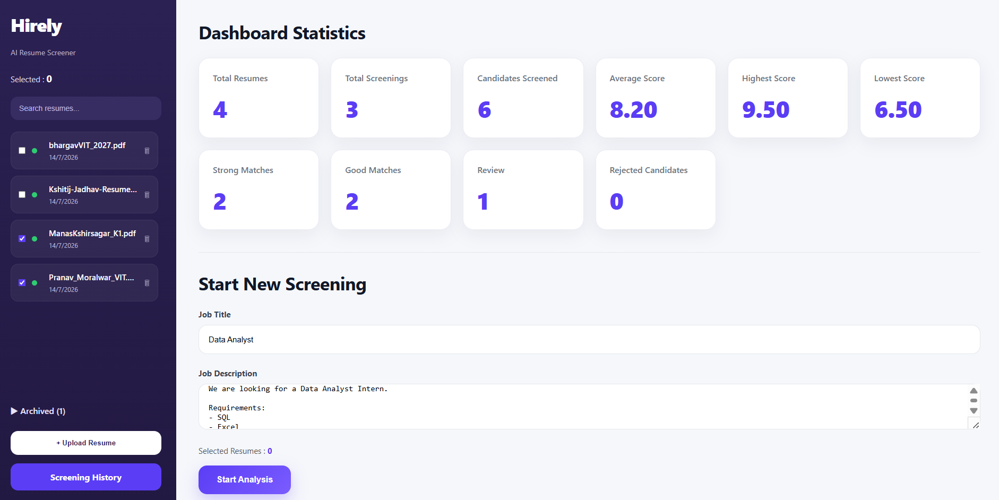
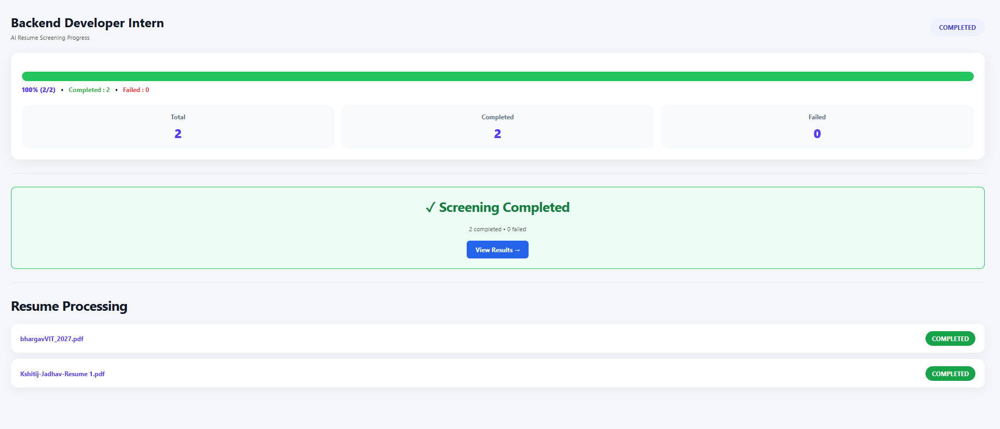
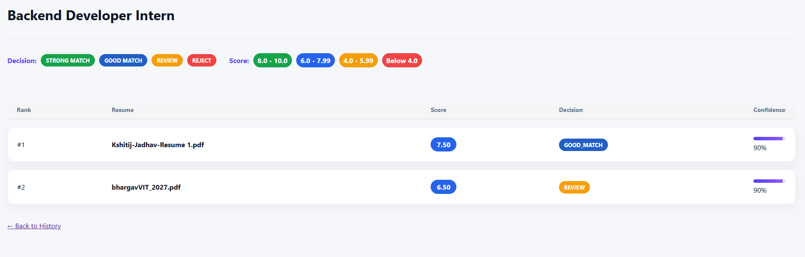
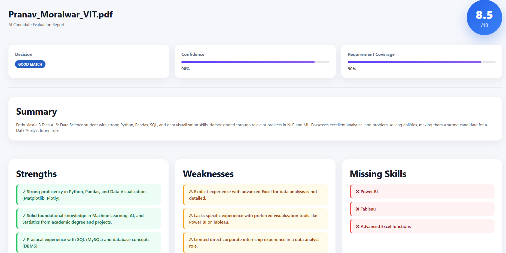
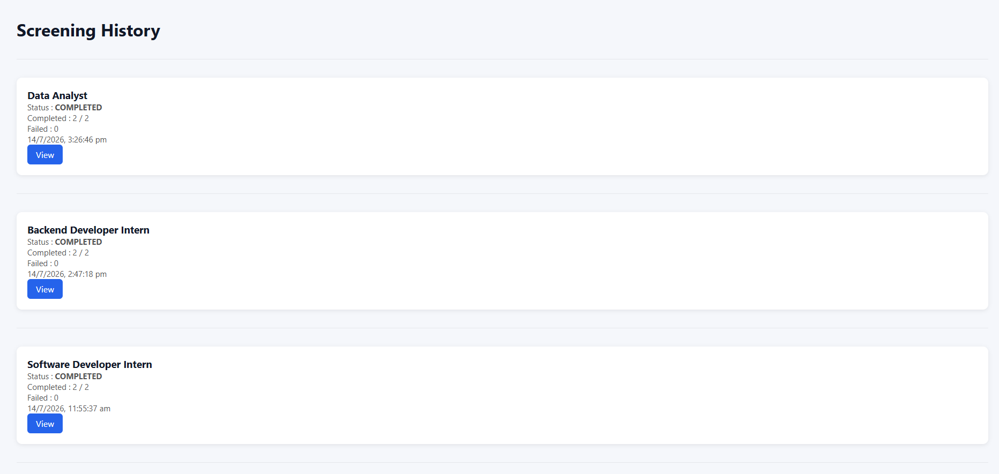
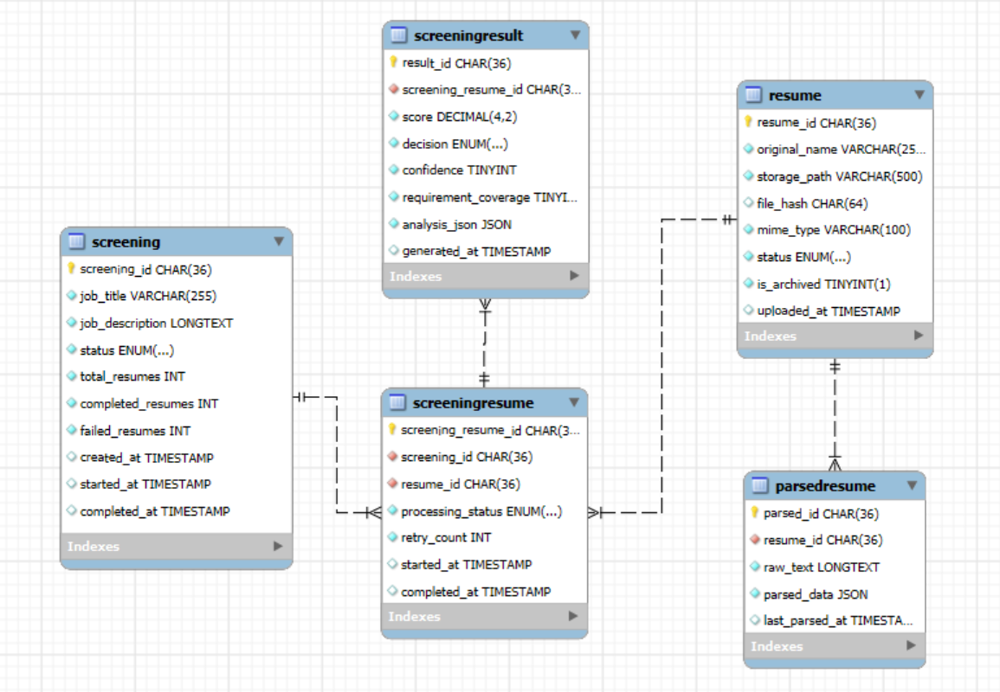

# Hirely | AI Powered Smart Resume Screener

An AI-powered Resume Screening System that automatically parses resumes, extracts structured candidate information, compares candidates against a Job Description using Google's Gemini LLM, and generates an explainable AI evaluation report.


## Screenshots

### Dashboard
<p align="center">
    
</p>

---

### Screening Progress
<p align="center">
    
</p>

---
### Screening Result
<p align="center">
    
</p>

---

### AI Report
<p align="center">
    
</p>

---
### Screening History
<p align="center">
    
</p>

---


## Overview
Hiring teams often spend significant time manually reviewing resumes before shortlisting candidates.

Hirely automates this process by:

- Parsing uploaded PDF resumes
- Extracting structured candidate information
- Comparing candidates with a Job Description
- Generating AI-based scores with explanations
- Ranking candidates
- Maintaining complete screening history

Unlike traditional keyword-based resume filters, Hirely uses Large Language Models (Gemini) to perform semantic candidate-job matching and provide evidence-backed justifications.

---

## Features

### Resume Management

- Upload multiple PDF resumes
- Automatic resume parsing
- Resume Library
- Search resumes instantly
- Archive / Restore resumes
- Delete resumes

---

## Key Highlights

- Two-stage AI pipeline (Resume Parsing → Candidate Matching)
- Semantic resume-job matching using Google Gemini
- Explainable AI with requirement-wise evidence
- Resume library with archive and search
- Live screening progress tracking
- AI-generated interview questions
- Reusable parsed resumes across multiple screenings

### AI Resume Parsing (Stage 1)

Each uploaded resume is converted into structured JSON containing:

- Summary
- Skills
- Experience
- Projects
- Education
- Certifications

The parsed profile is stored in MySQL for future screenings.

---

### AI Candidate Matching (Stage 2)

The extracted candidate profile is compared against a Job Description.

The AI generates:

- Match Score (0–10)
- Decision
- Confidence
- Requirement Coverage
- Summary
- Strengths
- Weaknesses
- Missing Skills
- Interview Questions
- Improvement Suggestions
- Requirement-wise Evidence

---

### Screening Dashboard

- Start a new screening
- Select multiple resumes
- Enter Job Title
- Enter Job Description
- View live screening progress

---

### Screening History

- View all previous screenings
- Open previous results
- Access detailed AI reports anytime

---

### AI Report 
Displays the complete AI-generated evaluation produced during Stage 2.

Every screened resume generates a detailed report including:

- Overall Evaluation
- Match Score
- Decision
- Confidence
- Requirement Coverage
- Strengths
- Weaknesses
- Missing Skills
- Evidence Mapping
- Interview Questions
- Improvement Suggestions

---

## Tech Stack

| Category | Technologies |
|----------|--------------|
| Backend | Node.js, Express.js |
| Frontend | HTML, CSS, EJS, JavaScript |
| Database | MySQL |
| AI | Google Gemini API |
| Libraries | Multer, PDF-Parse, UUID, Dotenv |


---

## Project Architecture

```
                Upload Resume (PDF)
                        │
                        ▼
                Resume Parsing
                        │
                        ▼
          Gemini Stage 1 (Extraction)
                        │
                        ▼
          Structured Candidate Profile
                        │
                        ▼
                Store in MySQL
                        │
────────────────────────┼────────────────────────
                        │
                  Start Screening
                        │
              Select Parsed Resumes
                        │
                Enter Job Description
                        │
                        ▼
           Gemini Stage 2 (Matching)
                        │
                        ▼
              Candidate Evaluation
                        │
                        ▼
        Store Screening Results (MySQL)
                        │
                        ▼
      Dashboard → Ranking → AI Report
```

---

## Database Design
The application uses a normalized MySQL database consisting of five primary tables to manage resumes, parsed candidate profiles, screening sessions, and AI-generated evaluation reports.

### Database Tables

| Table | Purpose |
|--------|---------|
| **Resume** | Stores uploaded resume metadata, file information, parsing status, and archive status. |
| **ParsedResume** | Stores the raw extracted resume text and the structured candidate profile generated during AI Stage 1. |
| **Screening** | Stores each screening session, including the job title, job description, overall status, and progress statistics. |
| **ScreeningResume** | Junction table that links resumes to a screening session and tracks the processing status of each resume. |
| **ScreeningResult** | Stores the AI evaluation generated during Stage 2, including score, decision, confidence, requirement coverage, and the complete JSON analysis. |

<p align="center">
    
</p>

The separation between **ParsedResume** and **ScreeningResult** allows resumes to be parsed only once while enabling the same candidate profile to be evaluated against multiple job descriptions in different screening sessions.


## Complete System Workflow

The following workflow illustrates how Hirely processes resumes from upload to AI-generated evaluation and report generation.

```text
                         USER

                           │
                           ▼

                Upload One or More PDF Resumes
                           │
                           ▼

                     Resume Table
        (Stores file metadata and upload details)
                           │
                           ▼

                 Extract Resume Text (PDF Parse)
                           │
                           ▼

                 Gemini Stage 1 - Resume Parsing
                           │
                           ▼

          Structured Candidate Profile (JSON)
     • Summary
     • Skills
     • Experience
     • Projects
     • Education
     • Certifications
                           │
                           ▼

                  ParsedResume Table
     (Stores raw text + structured candidate profile)
                           │
                           ▼

         Resume appears in Resume Library Dashboard
                           │
───────────────────────────┼───────────────────────────
                           │
                           ▼

              User selects one or more resumes
                           │
                           ▼

                 Enter Job Title
                           │
                           ▼

               Enter Job Description
                           │
                           ▼

                  Create Screening Session
                           │
                           ▼

                  Screening Table
        (Stores Job Details and Progress)
                           │
                           ▼

              Create ScreeningResume Records
      (Tracks processing status of every resume)
                           │
                           ▼

            Load Parsed Candidate Profile
                    from ParsedResume
                           │
                           ▼

              Gemini Stage 2 - AI Matching
                           │
                           ▼

         Candidate Profile + Job Description
                           │
                           ▼

                AI Candidate Evaluation

                 • Match Score (0–10)
                 • Decision
                 • Confidence
                 • Requirement Coverage
                 • Summary
                 • Strengths
                 • Weaknesses
                 • Missing Skills
                 • Interview Questions
                 • Improvement Suggestions
                 • Requirement-wise Evidence
                           │
                           ▼

               ScreeningResult Table
      (Stores complete AI-generated evaluation)
                           │
                           ▼

          Live Progress Tracking Updates
                           │
                           ▼

                 Screening Completed
                           │
                           ▼

                 View Ranked Candidates
                           │
                           ▼

         Click Candidate → Detailed AI Report
                           │
                           ▼

             Screening stored in History
          (Can be viewed again at any time)
```

### Key Design Advantage

Hirely separates **resume parsing** and **candidate evaluation** into two independent AI stages.

- **Stage 1** parses each resume only once and stores the structured candidate profile.
- **Stage 2** reuses the stored candidate profile for any number of future screening sessions.

This architecture reduces redundant AI calls, improves efficiency, and allows the same resume to be evaluated against multiple job descriptions without re-parsing the document.


## Folder Structure
```
Hirely
|
├── config/              # Database configuration
├── controllers/         # Route controllers
├── routes/              # Express routes
├── services/            # Business logic & AI services
├── validators/          # Request validation
├── public/
│   ├── css/
│   └── js/
├── storage/             # Uploaded resumes
├── views/               # EJS templates
├── screenshots/         # README images
├── app.js
├── package.json
└── README.md
```

---

## Installation

Clone the repository

```bash
git clone <repository-url>
```

Install dependencies

```bash
npm install
```

Create a .env file

```env
PORT=8080

DB_HOST=

DB_USER=

DB_PASSWORD=

DB_NAME=

GEMINI_API_KEY=
```

Run the application

```bash
npm run dev
```
Open your browser and navigate to: 

```text
http://localhost:8080
```

---

## Future Improvements

- Authentication & Recruiter Accounts
- Cloud-based Resume Storage
- PDF Export of AI Reports
- Resume Comparison
- Batch AI Processing
- Better Prompt Optimization
- Email Notifications

---

## Author
**Harsh**

Final Year B.Tech Project

Vishwakarma Institute of Technology, Pune

## License
This project was developed for academic and educational purposes.